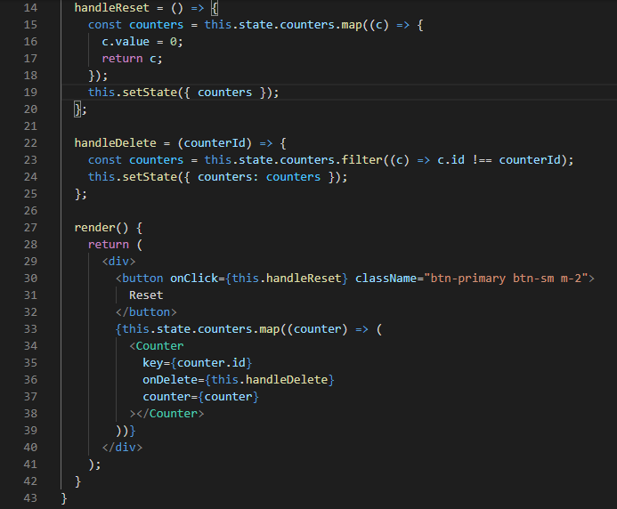
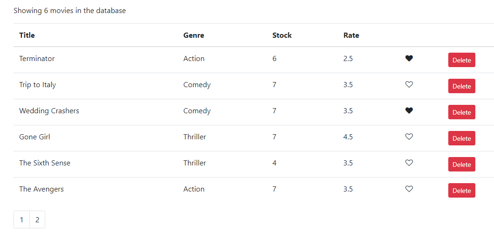
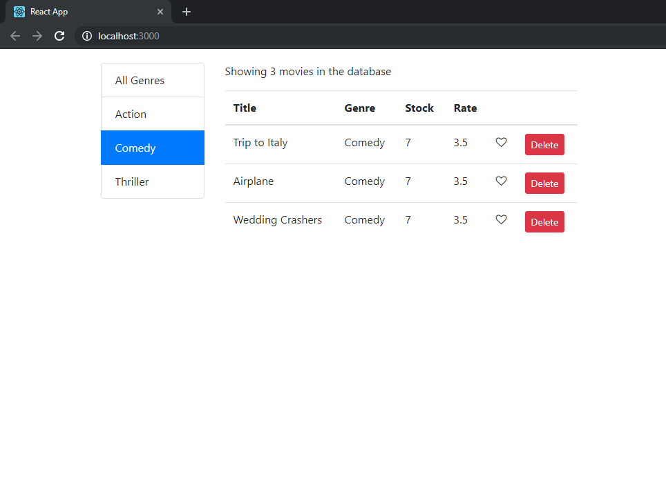
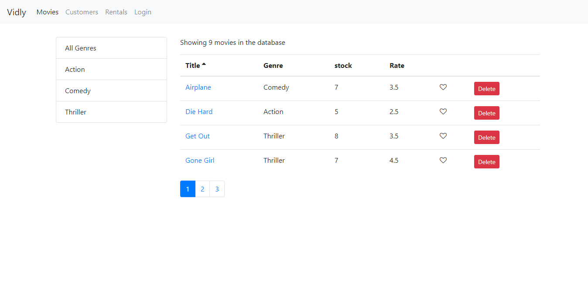
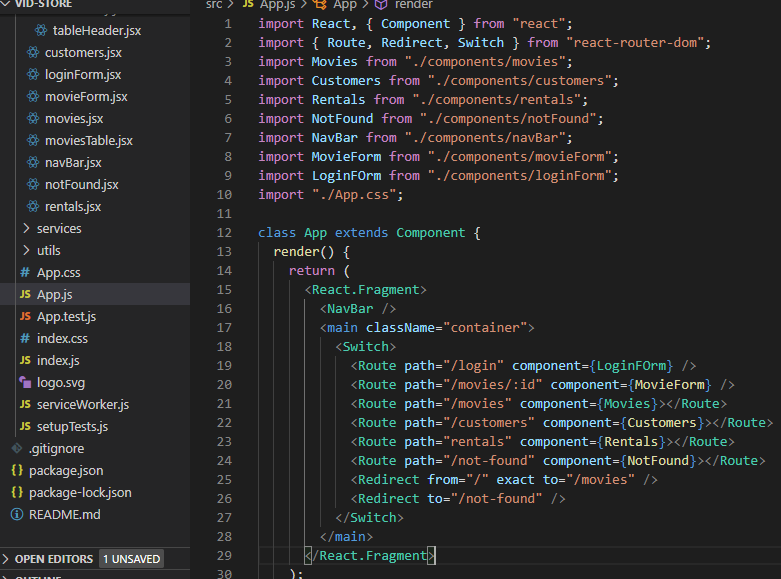
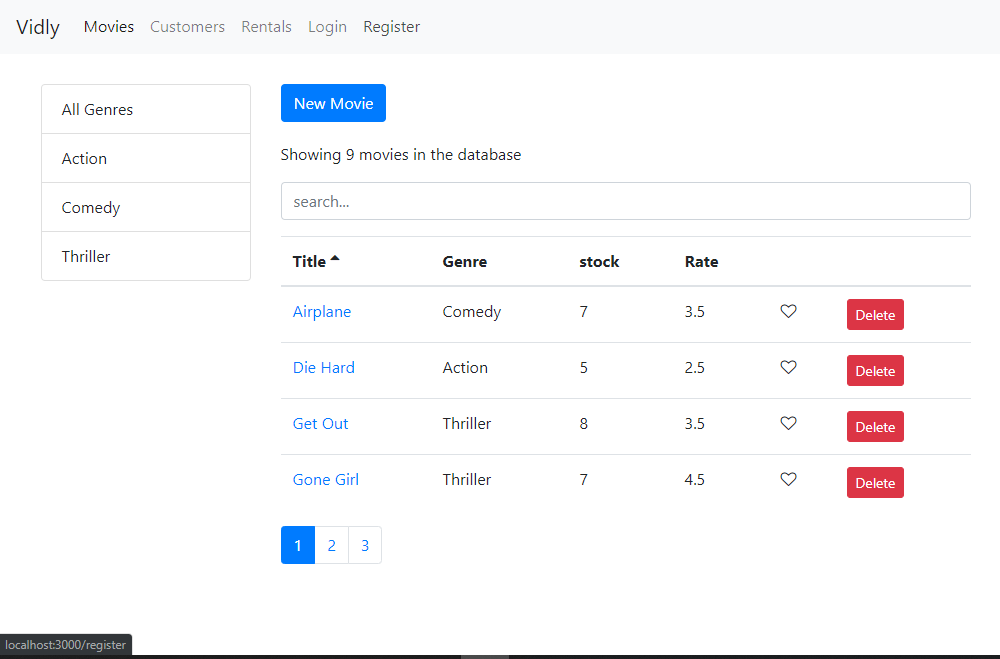

# 100 Days of Code Challenge

This repository contains my progress on the 100 days of code

## Day 1

- Setup dev environment for React
- Started working on first react app
  - Created main component

## Day 2: Continued work on React project

- Created a new component
- Added event handling
- implemented add, delete and reset functionality
- Used React Developer tools chrome extension to debug code.

## Day 3: Continued work on React project

- Added Nav Bar component
- updated code on other components
- shared state variables between components

## Day 4: React Project

- updated code on components
- Added tables with with data from backend
- Added pagination
- Added like functionality

## Day 5: React Project

- updated code on components
- updated backend code
- Added Filter functionality

## Day 6: React Project

- updated component and backend code
- Added sorting algorithm
- created reusable components
- refactored code for easy understanding

## Day 7: React Project

- Added routing
- created new components
- Added bootstrap navigation bar
- added login form

## Day 8: React Project

- updated component code
- Added form for new Movie
- implemented form validation using joi-brower package
- Implemented Search Functionality

