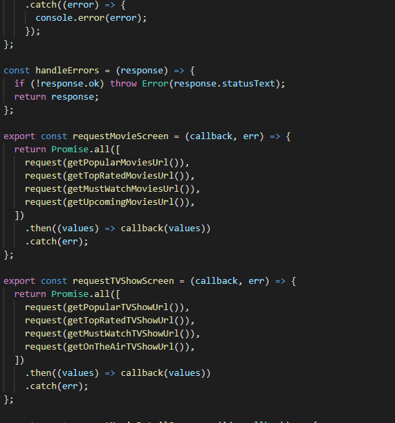

# 100 Days of Code Challenge

This repository contains my progress on the 100 days of code

## Day 1

- Setup dev environment for React
- Started working on first react app
  - Created main component

## Day 2: Continued work on React project

- Created a new component
- Added event handling
- implemented add, delete and reset functionality
- Used React Developer tools chrome extension to debug code.

## Day 3: Continued work on React project

- Added Nav Bar component
- updated code on other components
- shared state variables between components

## Day 4: React Project

- updated code on components
- Added tables with with data from backend
- Added pagination
- Added like functionality

## Day 5: React Project

- updated code on components
- updated backend code
- Added Filter functionality

## Day 6: React Project

- updated component and backend code
- Added sorting algorithm
- created reusable components
- refactored code for easy understanding

## Day 7: React Project

- Added routing
- created new components
- Added bootstrap navigation bar
- added login form

## Day 8: React Project

- updated component code
- Added form for new Movie
- implemented form validation using joi-brower package
- Implemented Search Functionality

## Day 9: Calling backend services with react

- added axios package for http request
- used jsonplaceholder end points for sample data
- implemented get, post, put and delete requests
- used Raven-js package for viewing log

## Day 10: Authentication and Authorization

- added Register user functionality in the database
- Handled register and login errors from the server
- Stored Json web token in the local Storage of browser
- Fixed bi-directional dependencies
- Added route protection

## Day 11: React app complete

- set environment variables
- built project for production
- created database in mongodb cloud
- Deployed app to heroku

## Day 12:

- Learnt more about higher order components and hooks in React
- Implemented context in a demo project to share data between components

## Day 13:

- Install android studio
- Install expo client
- Set up react native dev environment
- Initialised project

## Day 14:

- Learnt some React native core components and APIs
  - views
  - text
  - image
  - touchables
  - button
  - alert
  - stylesheet

## Day 15:

- Learnt how to create layouts in react native
- Learnt how to style react native elements
- Built Welcome screen for my project

## Day 16: React Native project

- Learnt how to work with lists
- Built profile screen, Messages screen, View Image screen and listings screen for app.

## Day 17: React Native project

- Learnt how to build forms with formik
- Built login and registeration forms
- Validated forms with yup

## Day 18: React Native project

- Learnt how to work with expo-location package
- Added icons from expo/vecto-icons to categories
- Improved form in my project

## Day 19

Added more styling to app and refactored code

## Day 20

- learnt how to get and post backend data with apisauce

## Day 21

- learnt how to work with AsyncStorage for caching data
- used react-native-expo-image-cache for caching images

## Day 22

- Added offline support to React App
- learnt how to cache data with Redux

## Day 23: React Native Project

- Implemented login and register with data from the server using a token
- Created a custom hook
- Implemented log out functionality

## Day 24: React Native Project

- Implemented both local and remote push notifications from the expo package

## Day 25: React Native Project

- Learnt and implemented bugsnap in project

## Day 26: React Native Project

- Optimized assets and javascript bundle
- set up environent variables
- Created app icon

## Day 27:

- Added material ui to new react project
- build a login form styled with material ui

## Day 28:

- Watched a complete tutorial on git commands and created a demo repo on github for practice

## Day 29:

- Did code refactoring and debugging on a react project

## Day 30:

- Learnt how to work with the twitter API for python (tweepy)
  Tweeted from a python script

## Day 31:

- Learnt most of the markdown elements and their syntax.
- Created a readme file with markdown for react project

## Day 32:

- Created a small quiz app using react following a tutorial from free code camp. this exercise helped with my understanding of the useState hook

## Day 33:

-Added some styling to my react quiz app and Completed a tutorial on redux.

## Day 34:

- Build a contact form in react and styled with material ui

## Day 35:

- Did more styling on react project

## Day 36:

- Added an about us page to react project and styled with basic css

## Day 37:

- Did more practice excercises with higher order components and React Context

## Day 38: React excercise from free code camp

- Created a small temperature increase/decrease react app using the useState hook.

## Day 39: React excercise

- Created a shopping cart app.

## Day 40:

- created a demo repo to practice most git commants and merging branches

## Day 41:

- Did a lot of code refactoring

## Day 42:

- did some styling practice on react with material ui styles

## Day 43:

- Dived deeper in to react native
- Fixed a major bug in a react app

## Day 44:

- Built a react count down app

## Day 45:

- Created react app for a portfolio website.
- Added a component for the homapage designed with raw css

## Day 46:

- Did styling with css for portfolio

## Day 47:

- Had some trouble with the signup form for a react project. I decided to impliment the forms using the formik package and it worked.

## Day 48:

- Added more chat screen to react native app.

## Day 49:

- Added styling to mobile app

## Day 50:

- Started a react project for hangman game

## Day 51:

- Added styling to react hangman game

## Day 52:

- followed a nosql db tutorial
- installed and configured mongodb

## Day 53:

- Learnt about replication in mongo db

## Day 54:

- refactored code for my portfolio website

## Day 55:

- Started learning nodejs from the basics.
- learnt to create a simple server
- Introduction to express framwork

## Day 56:

- Created database with collections and sample data in mongodb.

## Day 57:

- Learnt more about uding express framework in nodejs

## Day 58:

- Created users and auth routes for backend project build with nodejs.
- Used bycryptjs package for password encrytion
- Learnt how to validated form data with joi.

Day 59:

- created routes for all other models

Day 60:

- Solved issues I had with material ui styles in react.

Day 61:

- Learnt more about the usage of json web token and implemented it in a nodejs project

Day 62:

- Refactored code on my node js project

Day 63:

- Created a simple shopping list react app

Day 64:

- Learnt more about the json syntax

Day 65:

- Created new react native project for movies
- Learnt how to use the imdb movie APi with react native

Day 66:

- got and API key from TMDb and implemented in the project

Day 67:

- added movie screen for react movie app

Day 68:

- Rquested moves from the movie api
- classified the movies into different groups

Day 69:

- Added an events page component to a react project
- used cards from material ui to design event types

Day 70:

- Added a signup and login page to react project
- used material ui to style the pages

Day 71:

- worked on styling the homepage of the react project
- added a sticky footer

Day 72

- started working on a dashboard for my project

Day 73:

- Created a new component for react project;
- changed sign up form to modal

Day 74:

- did some more practice with mongodb commands and queries
- learnt more about the benefits of mongodb

day 75:

- Learnt about heroku and how to deploy and app.

Day 76:

- Sorted movies by category in my react native app
- designed search bar for app.

Day 77:

- Started learning oracle 12c database
- installed oracle database 12c enterprise

Day 78:

- Leant how to connect using sysdba
- created a pluggable database
- unlocked the hr account
- made connection easier in the tnsnarmes.ora files

Day 79: react-native

- Displayed movies in a row using flatlist.
- Dompleted design for movie screen.
- Did a lot of code refactoring.

Day 80:

- Select queries in oracle
- order by, fetch clauses

Day 81:

- Single row functions
  - character functions
  - number functions
  - date functions

Day 82:

- restricting and sorting data
- substitution variables

Day 83:

- NVL
- NVL2
- Decode
- Coalesce
