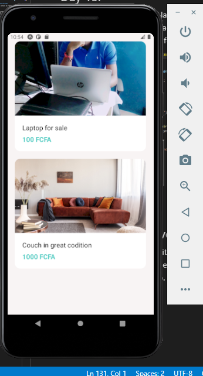

# 100 Days of Code Challenge

This repository contains my progress on the 100 days of code

## Day 1

- Setup dev environment for React
- Started working on first react app
  - Created main component

## Day 2: Continued work on React project

- Created a new component
- Added event handling
- implemented add, delete and reset functionality
- Used React Developer tools chrome extension to debug code.

## Day 3: Continued work on React project

- Added Nav Bar component
- updated code on other components
- shared state variables between components

## Day 4: React Project

- updated code on components
- Added tables with with data from backend
- Added pagination
- Added like functionality

## Day 5: React Project

- updated code on components
- updated backend code
- Added Filter functionality

## Day 6: React Project

- updated component and backend code
- Added sorting algorithm
- created reusable components
- refactored code for easy understanding

## Day 7: React Project

- Added routing
- created new components
- Added bootstrap navigation bar
- added login form

## Day 8: React Project

- updated component code
- Added form for new Movie
- implemented form validation using joi-brower package
- Implemented Search Functionality

## Day 9: Calling backend services with react

- added axios package for http request
- used jsonplaceholder end points for sample data
- implemented get, post, put and delete requests
- used Raven-js package for viewing log

## Day 10: Authentication and Authorization

- added Register user functionality in the database
- Handled register and login errors from the server
- Stored Json web token in the local Storage of browser
- Fixed bi-directional dependencies
- Added route protection

## Day 11: React app complete

- set environment variables
- built project for production
- created database in mongodb cloud
- Deployed app to heroku

## Day 12:

- Learnt more about higher order components and hooks in React
- Implemented context in a demo project to share data between components

## Day 13:

- Install android studio
- Install expo client
- Set up react native dev environment
- Initialised project

## Day 14:

- Learnt some React native core components and APIs
  - views
  - text
  - image
  - touchables
  - button
  - alert
  - stylesheet

## Day 15:

- Learnt how to create layouts in react native
- Learnt how to style react native elements
- Built Welcome screen for my project

## Day 16: React Native project

- Learnt how to work with lists
- Built profile screen, Messages screen, View Image screen and listings screen for app.

## Day 17: React Native project

- Learnt how to build forms with formik
- Built login and registeration forms
- Validated forms with yup

## Day 18: React Native project

- Learnt how to work with expo-location package
- Added icons from expo/vecto-icons to categories
- Improved form in my project

## Day 19

Added more styling to app and refactored code

## Day 20

- learnt how to get and post backend data with apisauce

## Day 21

- learnt how to work with AsyncStorage for caching data
- used react-native-expo-image-cache for caching images

## Day 22

- Added offline support to React App
- learnt how to cache data with Redux

## Day 23: React Native Project

- Implemented login and register with data from the server using a token
- Created a custom hook
- Implemented log out functionality

## Day 24: React Native Project

- Implemented both local and remote push notifications from the expo package

## Day 25: React Native Project

- Learnt and implemented bugsnap in project

## Day 26: React Native Project

- Optimized assets and javascript bundle
- set up environent variables
- Created app icon

## Day 27:

- Added material ui to new react project
- build a login form styled with material ui

## Day 28:

- Watched a complete tutorial on git commands and created a demo repo on github for practice

## Day 29:

- Did code refactoring and debugging on a react project

## Day 30:

- Learnt how to work with the twitter API for python (tweepy)
  Tweeted from a python script

## Day 31:

- Learnt most of the markdown elements and their syntax.
- Created a readme file with markdown for react project

## Day 32:

- Created a small quiz app using react following a tutorial from free code camp. this exercise helped with my understanding of the useState hook

## Day 33:

-Added some styling to my react quiz app and Completed a tutorial on redux.

## Day 34:

- Build a contact form in react and styled with material ui

## Day 35:

- Did more styling on react project

## Day 36:

- Added an about us page to react project and styled with basic css

## Day 37:

- Did more practice excercises with higher order components and React Context

## Day 38: React excercise from free code camp

- Created a small temperature increase/decrease react app using the useState hook.

## Day 39: React excercise

- Created a shopping cart app.

## Day 40:

- created a demo repo to practice most git commants and merging branches

## Day 41: 

- Did a lot of code refactoring
